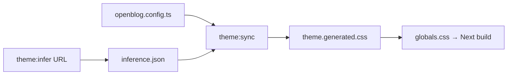

# OpenBlog theme system

OpenBlog ships **six mutually exclusive design-axis** brand presets, or can **infer the closest preset** from a product blog URL.

Optional non-theme capabilities (categories, tags, authors, RSS) are documented in **[features.md](./features.md)**.

## Six-axis presets

| slug | Axis | Reference brand |
|------|------|-----------------|
| `openai-monochrome` | Monochrome Light | OpenAI |
| `anthropic-parchment` | Serif Editorial Warm | Anthropic |
| `vercel-geist` | Developer Prose | Vercel |
| `linear-lavender-dark` | Dark Precision | Linear |
| `figma-magazine-pastel` | Magazine Expressive | Figma |
| `stripe-fintech-gradient` | Chromatic Fintech | Stripe |

Neutral built-in presets (non-brand exemplars): `product`, `minimal`, `editorial`.

## Configuration

### 1. Pick a preset directly

In repo-root `openblog.config.ts`:

```ts
theme: {
  preset: "vercel-geist",
  colorMode: "system", // light | dark | system
  strategy: "preset",
},
```

### 2. Infer from a product blog URL

```bash
npm run theme:infer -- --url https://vercel.com/blog
# Optional: write result into config
npm run theme:infer -- --url https://yourproduct.com/blog --write
npm run theme:sync
```

Inference output goes to `integrations/theme/.generated/inference.json` (gitignored).

Or reference only the URL in config:

```ts
theme: {
  referenceUrl: "https://vercel.com/blog",
  strategy: "hybrid",
},
```

`theme:sync` merges config + inference and writes `templates/next/src/app/theme.generated.css`.

## CSS variables

Each preset defines `--ob-color-*`, `--ob-font-*`, `--ob-radius-*`, and related tokens. Components should use these variables instead of hard-coded `zinc-*` classes.

## Design references

Per-axis detail: [theme-axes/](./theme-axes/).

## Workflow


